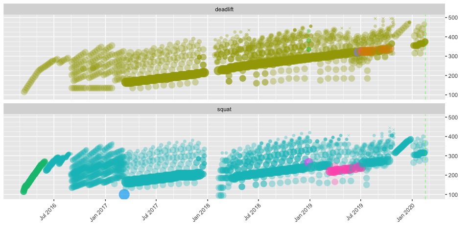
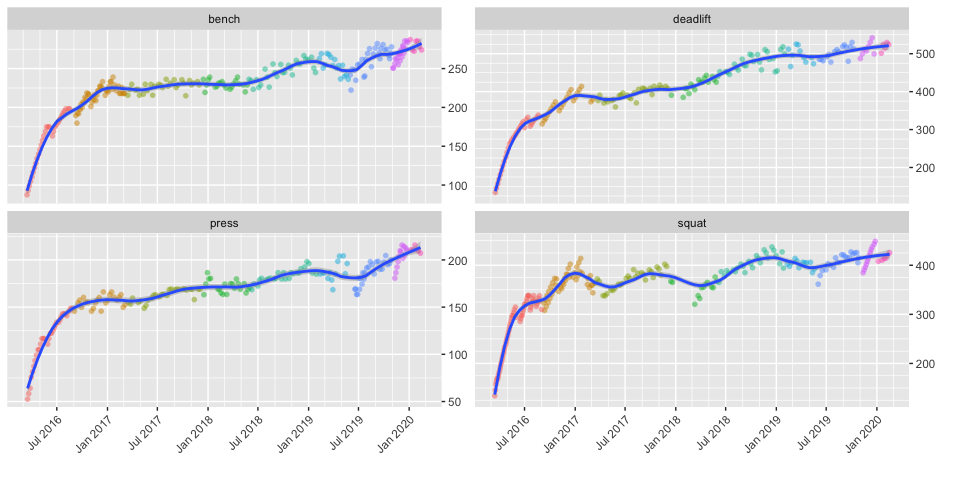
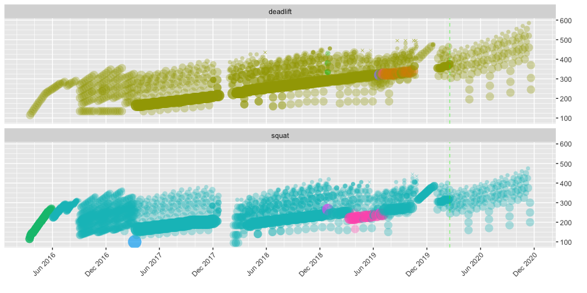

rweighlighting
================
Nathan Chaney
February 17, 2020

# Introduction

The rweightlifting package is designed to assist weightlifters and their
coaches with creating programs and monitoring trainees’ progress. The
package contains functions for calculating common variables used in
barbell training, such as 1-rep max, N-rep max, training maxes, tonnage,
etc. The package includes an interactive shiny dashboard that allows
weightlifters to visualize progress and compare common training programs
against past results.

# Reading Data

The load\_csv\_data() function reads all CSV files in the specified
directory. Each file should correspond to a specific weightlifting
program. The function expects a specific input format that includes a
header row, as follows:

`date, exercise, variant, set1weight, set1reps, set2weight, set2reps,
..., setNweight, setNreps`

``` r
weightlifting.log <- load_csv_data(datadir = my.datadir) %>% as_tibble()
```

The function creates a data table with one set per row, as
follows:

| program           | date       | exercise | equipment | variant      | set | reps | weight |
| :---------------- | :--------- | :------- | :-------- | :----------- | --: | ---: | -----: |
| 2020-01 5-3-1 cut | 2020-02-16 | deadlift | barbell   | conventional |   3 |    5 |    375 |
| 2020-01 5-3-1 cut | 2020-02-16 | deadlift | barbell   | conventional |   4 |    5 |    375 |
| 2020-01 5-3-1 cut | 2020-02-16 | deadlift | barbell   | conventional |   5 |    5 |    375 |
| 2020-01 5-3-1 cut | 2020-02-16 | squat    | barbell   | low bar      |   1 |    5 |    280 |
| 2020-01 5-3-1 cut | 2020-02-16 | squat    | barbell   | low bar      |   2 |    5 |    325 |
| 2020-01 5-3-1 cut | 2020-02-16 | squat    | barbell   | low bar      |   3 |    5 |    365 |

# Visualizing Data

The dashboard provided in the `shiny` directory contains many available
visualizations for common metrics used in weightlifting. A few examples
are provided below.

## Diary View

This view shows each set performed; it is a way to show progress (and
consistency) at a glance, as follows:

<!-- -->

In this view, you can see that a linear progression program was followed
at the beginning, followed by more complex programming over time. You
can also see a gap around January 2018, which is when I tore my calf
playing tennis and had to lay off lower body exercises for a while. The
colors indicate different exercise, equipment, and exercise variants.
Missed attempts (i.e., reps = 0) are denoted with an X shape.

## Strength View

The strength view uses a caculated one-rep max to show progress in
strength over time. It is a way to compare absolute strength across
different set/rep schemes and different goals, such as bulking or
cutting weight. In addition, the dashboard is capable of using a
corresponding body weight dataset to calculate a strength to weight
ratio in similar fashion, which provides a way to compare relative
strength over time.

<!-- -->

Broadly speaking, this view shows a lifter with increasing strength over
time. Bubbles of different colors denote different programs.

## Other Views

There are many other views shown in the dashboard located in the `shiny`
directory. These include:

  - Personal Records (PRs) by weight, program, tonnage, reps, and reps
    across
  - Tonnage broken down by exercise, week, and day
  - Ranges for weight and tonnage broken down by program
  - Calendars that show lift days, weight PRs, tonnage PRs, and rep PRs
  - A competition programming view to assist in selecting lifts for
    weightlifting competitions

# Creating a New Program

Weightlifters change programming periodically in order to accommodate
different goals, such as to increase the amount of work performed, to
change set/rep ranges, or to start fresh after a layoff due to illness.
The rweightlifting package contains functions designed to assist the
coach or lifter in preparing a new program. The starting position for
the new program is tied to a specific percentage of the lifter’s
previous one-rep maximum, which is called the training max. For
instance, a typical starting point after a week’s vacation might set the
training max at 90% of the lifter’s calculated 1RM over the last month.
The functions contain sensible defaults; the dashboard permits a user to
adjust pertinent variables in order to get the desired level of
difficulty.

For the lifter identified above, the package provides the following
cycle for a new program based on Jim Wendler’s basic 3-week 5-3-1
program:

| cycle | day | exercise | equipment | variant      | set | reps | percentage | training\_max | weight | max.reps |
| ----: | --: | :------- | :-------- | :----------- | --: | ---: | ---------: | ------------: | -----: | -------: |
|     1 |   1 | bench    | barbell   | flat         |   1 |    5 |       0.65 |         251.8 |    165 |       10 |
|     1 |   1 | bench    | barbell   | flat         |   2 |    5 |       0.75 |         251.8 |    190 |       12 |
|     1 |   1 | bench    | barbell   | flat         |   3 |    5 |       0.85 |         251.8 |    215 |        9 |
|     1 |   2 | squat    | barbell   | low bar      |   1 |    5 |       0.65 |         378.1 |    245 |        8 |
|     1 |   2 | squat    | barbell   | low bar      |   2 |    5 |       0.75 |         378.1 |    285 |        8 |
|     1 |   2 | squat    | barbell   | low bar      |   3 |    5 |       0.85 |         378.1 |    320 |        5 |
|     1 |   4 | press    | barbell   | overhead     |   1 |    5 |       0.65 |         189.8 |    125 |        8 |
|     1 |   4 | press    | barbell   | overhead     |   2 |    5 |       0.75 |         189.8 |    140 |        8 |
|     1 |   4 | press    | barbell   | overhead     |   3 |    5 |       0.85 |         189.8 |    160 |        6 |
|     1 |   5 | deadlift | barbell   | conventional |   1 |    5 |       0.65 |         466.8 |    305 |        8 |
|     1 |   5 | deadlift | barbell   | conventional |   2 |    5 |       0.75 |         466.8 |    350 |        5 |
|     1 |   5 | deadlift | barbell   | conventional |   3 |    5 |       0.85 |         466.8 |    395 |        9 |

For convenience, we can also add the maximum number of reps at each
specific weight the trainee is supposed to lift. This assists with
giving the lifter a “rep PR” to shoot for each time in the gym, which is
helpful for programs that recommend an AMRAP (as many reps as possible)
scheme for work sets such as Wender 5-3-1.

This information can be displayed alongside historical training
information to provide a visual representation of a new program’s
potential for gains over time:

<!-- -->

The vertical green line represents today (currently 17 Feb 2020);
projected performance following a new program is plotted to the right of
the green line. Another feature displayed here is the ability to program
deload weeks every so often – in this case after every 3 cycles. Note
that the projected work doesn’t necessarily include accessory or
supplemental work that may appear in historical data.

The supported programs include:

    ## [1] "Novice Linear Progression"                      
    ## [2] "4-Day Linear Progression"                       
    ## [3] "Madcow 5x5"                                     
    ## [4] "Wendler 5-3-1"                                  
    ## [5] "Wendler 5-3-1 Pyramid"                          
    ## [6] "Base 5-3-1, Bench 8-6-3"                        
    ## [7] "Lower 5-3-1 Last Set First, Upper 8-6-3 Pyramid"

It is desired that future versions of the package’s dashboard will
permit creation of custom programs on an exercise-by-exercise basis.

# Interactive Dashboard

This package is designed for interactive use via the dashboard in the
`shiny` directory. You’ll need to point the data source for both the
weightlifting logs and body weight logs to the right directories.
