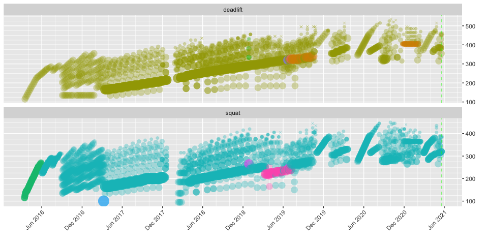

rweighlighting
================
Nathan Chaney
May 20, 2021

# Introduction

The rweightlifting package is designed to assist weightlifters and their
coaches with creating programs and monitoring trainees’ progress. The
package contains functions for calculating common variables used in
barbell training, such as 1-rep max, N-rep max, training maxes, tonnage,
etc. The package includes an interactive shiny dashboard that allows
weightlifters to visualize progress and compare common training programs
against past results.

# Reading Data

This package is designed for interactive use via the dashboard in the
`shiny` directory. You’ll need to point the data source for both
weightlifting logs and body weight logs to the right directories to use
the `shiny` app.

The `load_csv_data` function reads weightlifting logs. The expected
format is one CSV file for each weightlifting program. The
`load_csv_data` reads all CSV files in the specified directory. The
function expects an input format that includes a header row, as follows:

`date, exercise, equipment, variant, set1weight, set1reps, set2weight,
set2reps, ..., setNweight, setNreps`

``` r
weightlifting.log <- load_csv_data(datadir = my.datadir)
```

The function creates a data table with one set per row, as follows:

| program      | date       | exercise | equipment | variant      | set | reps | weight |
| :----------- | :--------- | :------- | :-------- | :----------- | --: | ---: | -----: |
| 2021-05\_531 | 2021-05-19 | deadlift | barbell   | conventional |   5 |    2 |    455 |
| 2021-05\_531 | 2021-05-19 | squat    | barbell   | low bar      |   1 |    5 |    320 |
| 2021-05\_531 | 2021-05-19 | squat    | barbell   | low bar      |   2 |    5 |    320 |
| 2021-05\_531 | 2021-05-19 | squat    | barbell   | low bar      |   3 |    5 |    320 |
| 2021-05\_531 | 2021-05-19 | squat    | barbell   | low bar      |   4 |    5 |    320 |
| 2021-05\_531 | 2021-05-19 | squat    | barbell   | low bar      |   5 |    5 |    320 |

# Visualizing Data

The dashboard provided in the `shiny` directory contains many available
visualizations for common metrics used in weightlifting. A few examples
are provided below.

## Diary View

This view shows each set performed; it is a way to show progress (and
consistency) at a glance, as follows:

<!-- -->

In this view, you can see that a linear progression program was followed
at the beginning, followed by more complex programming over time. You
can also see a gaps around January 2018 (when I tore my calf playing
tennis) and April 2020 (when gyms were closed due to the COVID-19
pandemic). The colors indicate different exercise, equipment, and
exercise variants. Missed attempts (i.e., reps = 0) are denoted with an
X shape.

## Strength View

The strength view uses a caculated one-rep max to show progress in
strength over time. It is a way to compare absolute strength across
different set/rep schemes.

<!-- -->

Broadly speaking, this view shows a lifter with increasing absolute
strength over time. Bubbles of different colors denote different
programs.

A similar view in the `shiny` app shows relative strength, which is
obtained by dividing a calculated 1-RM by the lifter’s body weight. This
view is useful for comparing a lifter’s performance to [strength
standards](https://www.t-nation.com/training/are-you-strong/), which
commonly reference multiples of body weight (e.g., 1x, 2x, 2.5x). It is
also useful for monitoring performance across bulking or cutting cycles.

<!-- -->

Note that the curves for absolute and relative strength are similar but
not identical. As one example, the estimated 1RM for the deadlift has
hovered around 500 - 525 since December 2018. However, the absolute
strength has declined from a high of around 2.5x in June 2018 to around
2.3-2.4x as of the time of writing (this is attributable to the, ahem,
COVID nineteen pounds). I generally use the absolute strength view
during bulking cycles (for comparison against all-time strength) and the
relative strength view during cutting cycles (to make sure I’m not
losing ground).

## Other Views

There are many other views shown in the dashboard located in the `shiny`
directory. These include:

  - Personal Records (PRs) by weight, program, tonnage, reps, and reps
    across
  - Tonnage broken down by exercise, week, and day
  - Ranges for weight and tonnage broken down by program
  - Calendars that show lift days, weight PRs, tonnage PRs, and rep PRs
  - A competition programming view to assist in selecting lifts for
    weightlifting competitions

# Creating a New Program

Weightlifters change programming periodically in order to accommodate
different goals, such as to increase the amount of work performed, to
change set/rep ranges, or to start fresh after a layoff due to illness.
The rweightlifting package contains functions designed to assist the
coach or lifter in preparing a new program. The starting position for
the new program is tied to a specific percentage of the lifter’s
previous one-rep maximum, which is called the training max. For
instance, a typical starting point after a week’s vacation might set the
training max at 90% of the lifter’s calculated 1RM over the last month.
The functions contain sensible defaults; the dashboard permits a user to
adjust pertinent variables in order to get the desired level of
difficulty.

For the lifter identified above, the package provides the following of a
new program based on Jim Wendler’s basic 3-week 5-3-1 program (this is
the first week only):

| cycle | day | date       | exercise | equipment | variant      | set | reps | percentage | training\_max | weight | max.reps |
| ----: | --: | :--------- | :------- | :-------- | :----------- | --: | ---: | ---------: | ------------: | -----: | -------: |
|     1 |   1 | 2021-05-21 | bench    | barbell   | flat         |   1 |    5 |       0.65 |         267.5 |    175 |       11 |
|     1 |   1 | 2021-05-21 | bench    | barbell   | flat         |   2 |    5 |       0.75 |         267.5 |    200 |       11 |
|     1 |   1 | 2021-05-21 | bench    | barbell   | flat         |   3 |    5 |       0.85 |         267.5 |    225 |       11 |
|     1 |   2 | 2021-05-22 | squat    | barbell   | low bar      |   1 |    5 |       0.65 |         392.0 |    255 |        8 |
|     1 |   2 | 2021-05-22 | squat    | barbell   | low bar      |   2 |    5 |       0.75 |         392.0 |    295 |        8 |
|     1 |   2 | 2021-05-22 | squat    | barbell   | low bar      |   3 |    5 |       0.85 |         392.0 |    335 |        7 |
|     1 |   4 | 2021-05-24 | press    | barbell   | overhead     |   1 |    5 |       0.65 |         199.9 |    130 |        9 |
|     1 |   4 | 2021-05-24 | press    | barbell   | overhead     |   2 |    5 |       0.75 |         199.9 |    150 |        8 |
|     1 |   4 | 2021-05-24 | press    | barbell   | overhead     |   3 |    5 |       0.85 |         199.9 |    170 |        8 |
|     1 |   5 | 2021-05-25 | deadlift | barbell   | conventional |   1 |    5 |       0.65 |         460.9 |    300 |        8 |
|     1 |   5 | 2021-05-25 | deadlift | barbell   | conventional |   2 |    5 |       0.75 |         460.9 |    345 |        8 |
|     1 |   5 | 2021-05-25 | deadlift | barbell   | conventional |   3 |    5 |       0.85 |         460.9 |    390 |       10 |

For convenience, we can also add the maximum number of reps at each
specific weight the trainee is supposed to lift. This assists with
giving the lifter a “rep PR” to shoot for each time in the gym, which is
helpful for programs that recommend an AMRAP (as many reps as possible)
scheme for work sets such as Wender 5-3-1.

This information can be displayed alongside historical training
information to provide a visual representation of a new program’s
potential for gains over time:

<!-- -->

The vertical green line represents today (currently 20 May 2021);
projected performance resulting from compliance with the new program is
plotted to the right of the green line. Another feature displayed here
is the ability to program deload weeks every so often – in this case
after every 3 cycles. Note that the projected work doesn’t necessarily
include accessory or supplemental work that may appear in historical
data.

The supported programs include:

    #> [1] "Novice Linear Progression"                      
    #> [2] "4-Day Volume-Intensity Split"                   
    #> [3] "Madcow 5x5"                                     
    #> [4] "Wendler 5-3-1"                                  
    #> [5] "Wendler 5-3-1 Pyramid"                          
    #> [6] "Base 5-3-1, Bench 8-6-3"                        
    #> [7] "Lower 5-3-1, Upper 8-6-3, Last Set First"       
    #> [8] "Lower 5-3-1 with 1 Backoff, Upper 8-6-3 Pyramid"

It is desired that future versions of the package’s dashboard will
permit creation of custom programs on an exercise-by-exercise basis.
