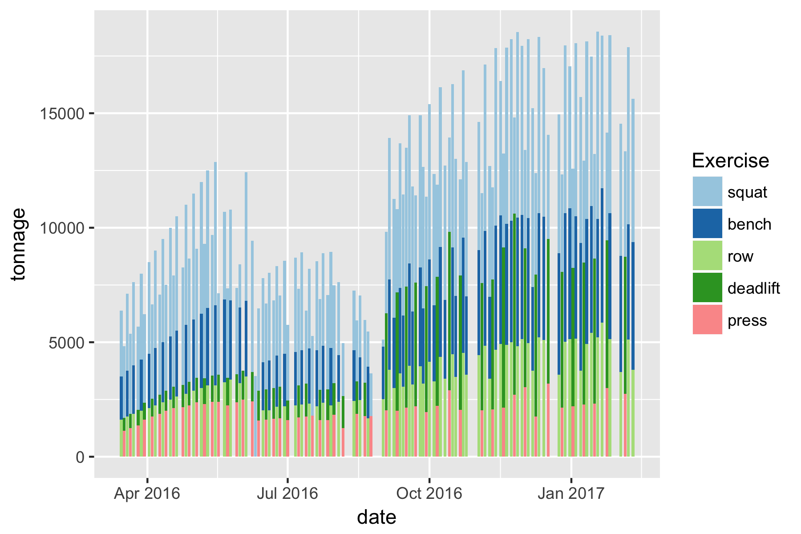
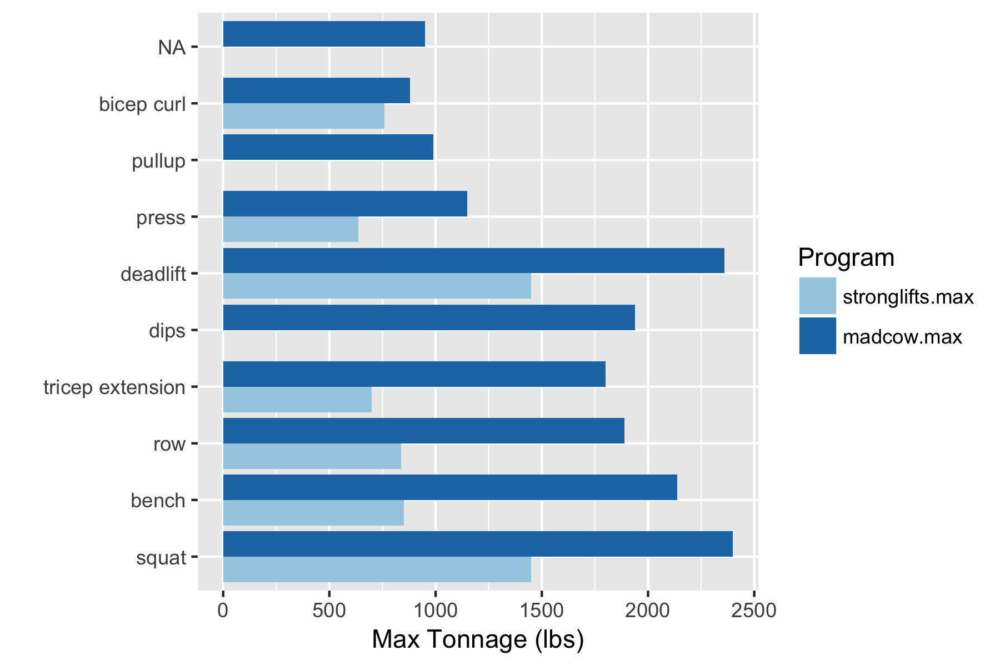
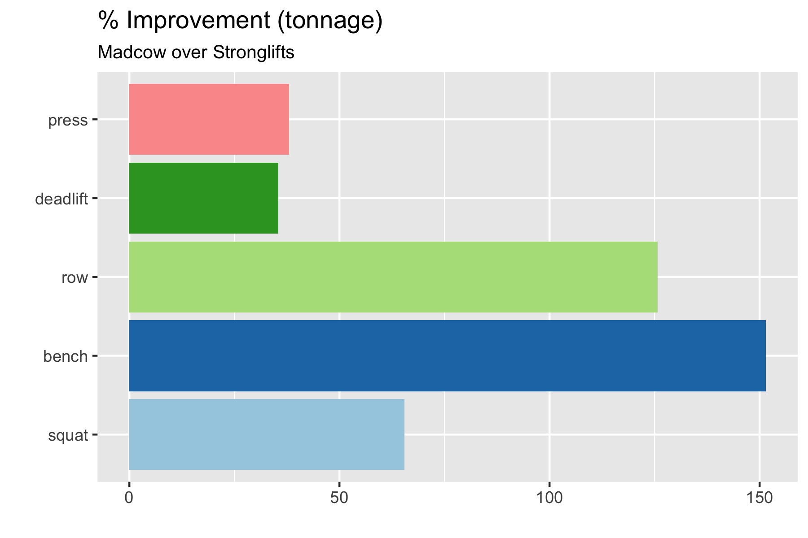
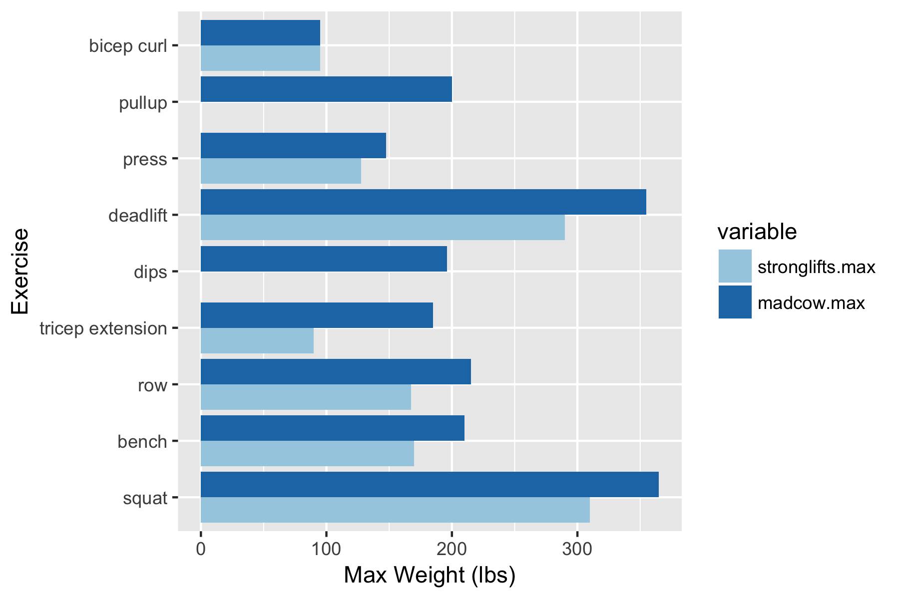
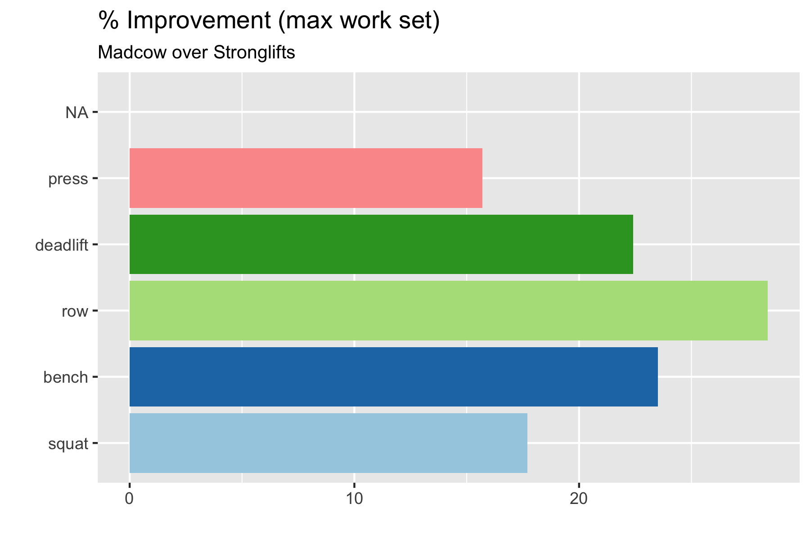
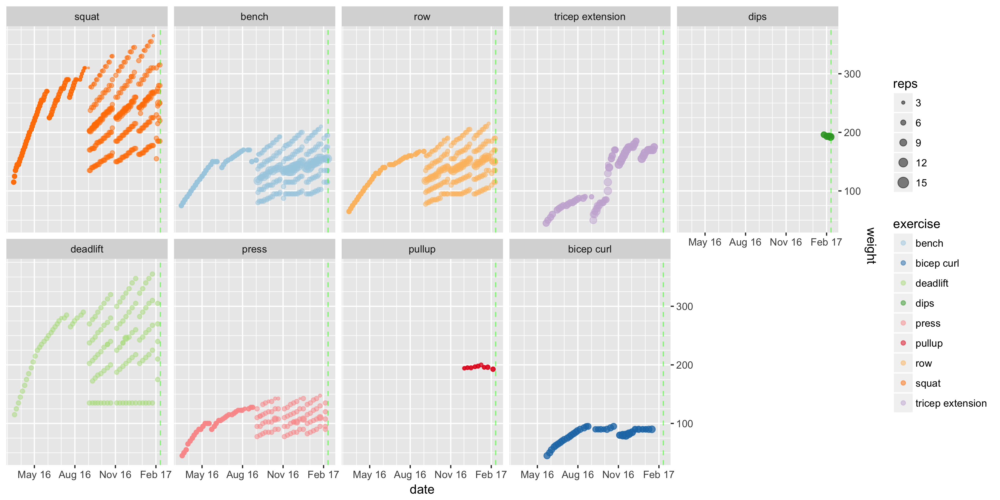
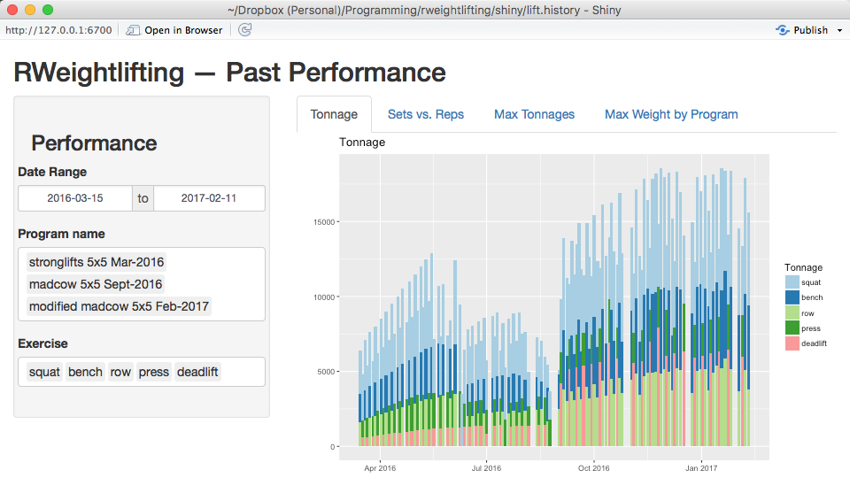
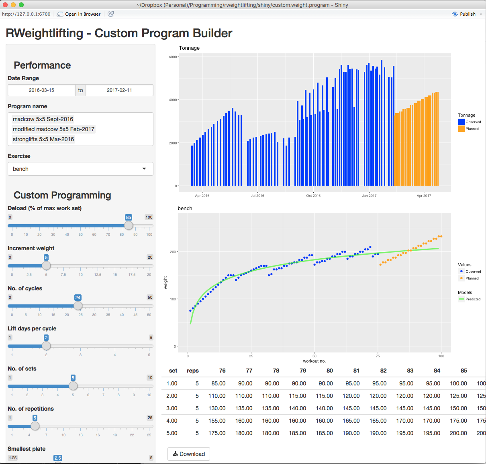

# To Do

* Simple vs. advanced planning (simple gives common routines like 5-3-1, Stronglifts, Madcow, etc.)
* Aggregate planned cycles for each lift to printable worksheet/schedule format -- Use tabs for each lift desired to plan, then rbind tables created in each tab (will require separate input for each one?)
* try polynomial fitting instead of log fitting
* compare error of polynomial fitting to log fitting
* number of cycles/programs dictates order of polynomial fitting?

# Narrative

I started lifting weights in March 2016 because my belly was too much larger than my shoulders, and I don't want to look like a frail old guy. I've lifted for a few months at a time before, but never stuck with it for more that 3 or 4 months. This time, however, I have been more diligent -- so much so, in fact, that I had to switch from a beginner program [(Stronglifts 5x5)](http://stronglifts.com/5x5/) to an intermediate schedule [(Madcow)](http://stronglifts.com/madcow-5x5-training-programs/) because I had stopped improving.

In Stronglifts 5x5, you alternate between 2 groups of 3 lifts (A: squat, bench, barbell row; B: squat, overtail press, and deadlift). You warm up, then lift 5 sets of 5 reps. When you successfully complete the lift, you add weight (2.5 lbs or 5 lbs, depending on the lift) the next time you perform the lift. If you fail, you deload. If you fail again, you reduce the number of sets and reps (5x3, 3x3, etc.).

Stronglifts is good for beginners like me because the weight starts low and you see rapid improvement. However, once the weight gets heavy (e.g., squatting 300 lbs), the volume of work simply gets to be too much for adequate recovery.

Madcow is a 12-week program similar to Stronglifts in that the work set (the max weight you use on a particular lift) is a heavy weight, low rep set. However, it is just a single set, and you perform incremental lifts to reach that set.

The Stronglifts app had charts that showed progress over time. However, I haven't found an app I like that lets you customize the lifts you're doing. I've seen things like Strongr that are customizable, but the learning curve seems steep and I'd rather apply that learning to R. 

# Libraries

```{r Setup, include=FALSE, echo = FALSE}
knitr::opts_chunk$set(echo = TRUE)
my.datadir <- "~/.bin/rweightlifting/raw-data/"
my.imagedir <- "~/.bin/rweightlifting/images/"
```

```{r Libraries, warning=FALSE, alert=FALSE, message=FALSE}
library(ggplot2)
library(plyr)
library(dplyr)
library(data.table)
library(plotly)
library(rweightlifting)

```

# Data Import & Munging

## Weightlifting Data

The load_csv_data() function reads all CSV files in the specified directory. Each file should correspond to a specific weightlifting program. The function expects a specific input format that includes a header row.

Future plans include the ability to import CSV data from the StrongLifts 5x5 app.

```{r warning=FALSE, alert=FALSE, message=FALSE}
# Expected CSV format:
# date,exercise,variant,set1weight,set1reps,set2weight,set2reps,set...weight,set...reps,setNweight,setNreps
# E.g., 2017-01-26,bench,barbell,102.5,5,135,5,155,5,180,5,210,3,155,13
data <- load_csv_data(datadir = my.datadir)
tail(data)
```

# Munge and Summarize

We've created two different tables here. One contains data for all sets, and the other just contains data for the top work set for each day. Here's what the summary dataset looks like:

```{r include=TRUE, echo=TRUE, warning=FALSE, alert=FALSE, message=FALSE}
start.date <- min(data$date, na.rm=TRUE)

exercises <- c("squat", "bench", "row", "tricep extension", "dips", "body weight", "deadlift", "press", "pullup", "bicep curl")

Comp.opt <- function(data)
{
    output <- integer(length(data)-1L)
    for(i in seq_along(output))
    {
        output[[i]] <- (data[[i]] >= 0.85 * data[[i+1L]])
    }
    return(output)
}

summary <- ddply(data, date ~ exercise, function(x)x[which.max(x$weight), ])
summary <- summary[with(summary, order(exercise, date)),]
true.max <- as.logical(Comp.opt(summary$weight))
summary <- subset(summary, true.max)

data$exercisef <- factor(data$exercise, levels = exercises, ordered=TRUE) 
summary$exercisef <- factor(summary$exercise, levels = exercises, ordered=TRUE) 

tail(summary)
#tail(data)
```

# Program Analysis

As discussed in the introduction, I wound up switching programs after the weight got heavy. Moving forward, I wanted to be able to monitor my progress given the switch, and see how much stronger I got after switching programs. 

# Tonnage

One thing weightlifters need to keep an eye on is the total volume of work they perform for a given lift and in a given workout. This is called tonnage. Generally speaking, tonnage needs to keep increasing if you want to get bigger and stronger.

```{r warning=FALSE, alert=FALSE, message=FALSE}
library(dplyr)
tonnes <- data %>%
  filter(! exercisef %in% c("tricep extension", "bicep curl", "pullup", "dips")) %>%
  mutate(tonnage = weight * reps, date = as.POSIXct(paste(date, "18:00:00", sep=""), format = "%Y-%m-%d", tz = "America/Chicago"))

tonnage <- ggplot(tonnes) +
  geom_bar(aes(date, tonnage, fill = exercisef), stat = "identity") +
  scale_fill_brewer("Exercise", palette="Paired")

#ggplotly(tonnage)
ggsave(paste(my.imagedir, "tonnage.png", sep=""), tonnage, width=6, height=4)
```



As you can see here, there's a period of time in the summer of 2016 where my tonnages fell off. This was a function of the way the SL 5x5 program works. If you can't lift 5x5 for a certain lift, it backs you off to 3 sets by 5 reps, then 3x3, 1x3, and so on. Unfortunately, the result of this programming "feature" is that my tonnages fell off, essentially causing a stall. I wish I would have been keeping an eye on this!

 Once I switched programs, I got the tonnages back up pretty quickly. Here's what they looked like compared as between the two programs:
 
```{r warning=FALSE, alert=FALSE, message=FALSE}
stronglifts.stop <- as.Date("2016-09-01")
stronglifts.tonnage <- data[data$date <= stronglifts.stop, ] %>%
  mutate(tonnage = weight * reps, date = as.POSIXct(paste(date, "18:00:00", sep=""), format = "%Y-%m-%d", tz = "America/Chicago")) %>%
  group_by(exercisef) %>% summarize(stronglifts.max = max(tonnage)) 

madcow.tonnage <- data[data$date > stronglifts.stop, ] %>%
  mutate(tonnage = weight * reps, date = as.POSIXct(paste(date, "18:00:00", sep=""), format = "%Y-%m-%d", tz = "America/Chicago")) %>%
  group_by(exercisef) %>% 
  summarize(madcow.max = max(tonnage))

tonnages.maxes <- merge(stronglifts.tonnage, madcow.tonnage, all = TRUE)
mdata <- melt(tonnages.maxes, id=c("exercisef"))
tonnages.maxes$diff <- tonnages.maxes$madcow.max - tonnages.maxes$stronglifts.max
tonnages.maxes$diff.percent <- round(tonnages.maxes$diff / tonnages.maxes$stronglifts.max * 100, 1)
# This will change to in SELECTED instead of ! IN this static list
tonnages.maxes <- tonnages.maxes %>%
  filter(! exercisef %in% c("tricep extension", "bicep curl", "pullup", "dips"))

mdata.plot <- ggplot(mdata) +
  scale_fill_brewer("Program", palette="Paired") +
  geom_bar(aes(exercisef, value, fill = variable, group=variable), stat = "identity", position = "dodge") +
  xlab("") +
  ylab("Max Tonnage (lbs)") +
  coord_flip()

tonnages.maxes.plot <- ggplot(tonnages.maxes) +
  scale_fill_brewer("Exercise", palette="Paired") +
  geom_bar(aes(exercisef, diff.percent, fill = exercisef), stat = "identity", position = "dodge", na.rm = TRUE) +
#   theme(
# 	  axis.text.x = element_text(angle = 45),
#   ) +
  labs(title = "% Improvement (tonnage)", 
       subtitle = "Madcow over Stronglifts",
       x = "",
       y = "") +
  coord_flip() +
  theme(
    legend.position = "none"
  )

ggsave(paste(my.imagedir, "tonnages.maxes.png", sep=""), mdata.plot, width=6, height=4)
ggsave(paste(my.imagedir, "tonnages.percentages.png", sep=""), tonnages.maxes.plot, width=6, height=4)
```




Ever since I was a kid, my lower body was always stronger. As a seventh grader, I could leg press the entire amount of weight on the machine in the junior high gym. However, I could barely bench press any weight. So, I've focused on increasing the volume of the bench press and row to try and get my upper body up to speed.

As you can see here, the bench tonnage went up almost 2.5x!

## Max Lift

Now, let's see if that work paid off in terms of max lift:

```{r warning=FALSE, alert=FALSE, message=FALSE}
#summary(data[data$date <= stronglifts.stop, ], by=exercisef)
stronglifts.max <- data[data$date <= stronglifts.stop, ] %>% group_by(exercisef) %>% summarize(stronglifts.max = max(weight))
madcow.max <- data[data$date > stronglifts.stop, ] %>% group_by(exercisef) %>% summarize(madcow.max = max(weight))

maxes <- merge(stronglifts.max, madcow.max, all = TRUE)
mdata <- melt(maxes, id=c("exercisef"))
maxes$diff <- maxes$madcow.max - maxes$stronglifts.max
maxes$diff.percent <- round(maxes$diff / maxes$stronglifts.max * 100, 1)

maxes <- maxes %>%
  filter(! exercisef %in% c("tricep extension", "bicep curl", "pullup", "dips"))

mdata.plot <- ggplot(mdata) +
  scale_fill_brewer(palette="Paired") +
  geom_bar(aes(exercisef, value, fill = variable, group=variable), stat = "identity", position = "dodge") +
  xlab("Exercise") +
  ylab("Max Weight (lbs)") +
  coord_flip()
  
maxes.plot <- ggplot(maxes) +
  scale_fill_brewer("Exercise", palette="Paired") +
  geom_bar(aes(exercisef, diff.percent, fill = exercisef), stat = "identity", position = "dodge", na.rm = TRUE) +
#   theme(
# 	  axis.text.x = element_text(angle = 45),
#   ) +
  labs(title = "% Improvement (max work set)", 
       subtitle = "Madcow over Stronglifts",
       x = "",
       y = "") +
  coord_flip() +
  theme(
    legend.position = "none"
  )

ggsave(paste(my.imagedir, "lifts.maxes.png", sep=""), mdata.plot, width=6, height=4)
ggsave(paste(my.imagedir, "lifts.percentages.png", sep=""), maxes.plot, width=6, height=4)
```





Here we see that bench and row showed the most improvement during the Madcow program, somewhere around 25% for each.

# Plotting

Finally, here's an overview plot that shows all sets and reps over time. Sometimes lifting seems like it's progressing slowly! This view is useful for seeing incremental advancement over time to avoid discouragement. 

```{r warning=FALSE, alert=FALSE, message=FALSE}
today <- Sys.Date()
date.window <- seq(Sys.Date(), length = 2, by = "-6 months")[2]

plot.full <- ggplot(data=data, aes(date, weight, color=exercise, size=reps)) +
  scale_color_brewer(palette="Paired") +
  facet_wrap( ~ exercisef, ncol=5) +
  geom_point(data=data, aes(date, weight, color=exercise), alpha=0.5) +
  scale_radius(range = c(0.5, 4), breaks=c(3,6,9,12,15)) +
  scale_y_continuous(
    position="right",
    minor_breaks=function(x){
      seq(0, ceiling(max(x)), 25)
      }) +
  scale_x_date(
    date_breaks = "3 month", date_labels = "%b %y",
    date_minor_breaks = "1 month"
  ) +
  #coord_cartesian(xlim = c(date.window, today)) +
  coord_cartesian(xlim = c(start.date, today)) +
  geom_vline(aes(xintercept = as.numeric(Sys.Date())), color=alpha("green", 0.5), linetype="dashed")

plot.full.trendline <- plot.full +
  geom_line(data=summary, aes(date, weight, color=exercise), size=1, alpha=1) +
  labs(caption = paste("image generated at ", Sys.time(), sep = ""))

ggsave(paste(my.imagedir, "all.lifts.png", sep=""), plot.full, width=12, height=6)
```



# Shiny App

This package comes with a couple of Shiny apps that incorporate the type of information provided above, but let you interact with the charts. One lets you see your progress across all programs, and you can filter by date, program, and exercise:



The other Shiny app is a custom program builder that lets you specify a number of different variables for each lift, and plots planned tonnages and max work sets against historical progress. The plot also shows a logarithmic model of your historical data so your planned program doesn't stray too far from what's likely possible. This lets you fine-tune your program in the event you need to recover from injury or focus on improving a specific lift.


